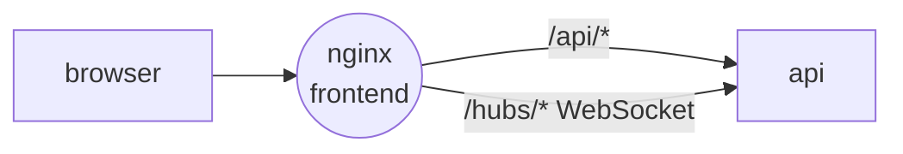

<div align="center">

<a href="https://gitlab.com/pingtower"></a>

# 🖥️ frontend

### Monitoring dashboard: servers, live statuses, latency charts and notification settings

[](https://gitlab.com/pingtower/frontend/-/pipelines)


<sub>Part of <a href="https://gitlab.com/pingtower"><b>PingTower</b></a> — real-time server availability monitoring</sub>

</div>

---

## Role in the system

The single-page app users interact with. It talks only to the [api](https://gitlab.com/pingtower/api):
REST for data and a SignalR connection for live status updates, so a server going down shows up on the
dashboard without a page refresh. In production it is served by nginx, which also proxies `/api` and
`/hubs` to the backend.



## Features

- **Dashboard** — table of servers with protocol, host and live `UP` / `DOWN` status pushed over SignalR.
- **Server details** — latency charts, uptime, ping history and editable ping settings.
- **Auth flows** — login, registration, email verification, forgot / reset password; JWT with refresh.
- **Notifications** — per-user notification settings and Telegram account linking via the Login Widget.
- **Landing page** — public product page at `/`.

### Routes

| Path | Page |
| --- | --- |
| `/` | landing |
| `/login`, `/register`, `/forgot-password`, `/reset-password`, `/verify-email` | auth |
| `/app/servers` | dashboard |
| `/app/servers/:serverId` | server details |
| `/app/settings/notifications` | notification settings |
| `/app/settings/integrations` | Telegram integration |

## Quick start

**Whole stack** — via [infra](https://gitlab.com/pingtower/infra) (all repos cloned side by side):

```bash
make -C infra up
```

**This app only** (api already running):

```bash
cp .env.example .env
docker compose up -d --build
```

**Local development:**

```bash
pnpm install
pnpm dev      # VITE_API_URL points to the api, http://localhost:8080 by default
pnpm lint
pnpm build
```

## Structure

Feature-Sliced Design:

```text
frontend/
├── nginx/                 # default.conf.template: SPA fallback, /api and /hubs proxy
└── src/
    ├── app/               # providers, router
    ├── pages/             # route-level pages
    ├── widgets/           # dashboard, server-table, server-detail
    ├── features/          # auth, monitoring
    ├── entities/          # domain types
    └── shared/            # api client, stores (Zustand), lib, ui (Radix / shadcn)
```
